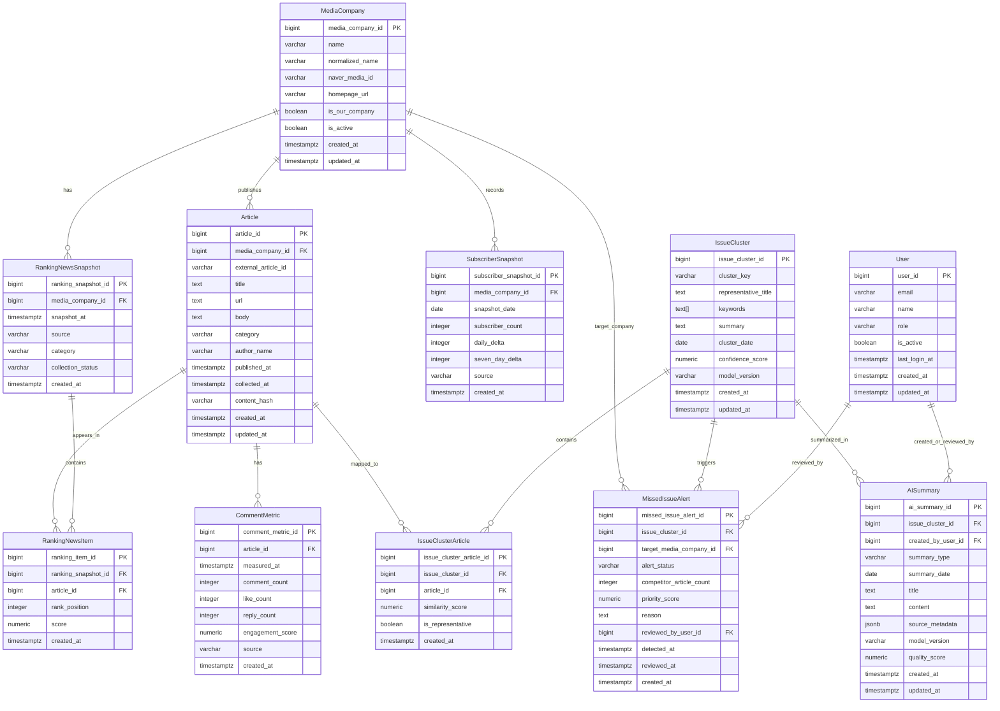

# ERD 문서: AI 기반 내부 미디어 모니터링 및 인사이트 대시보드

## 1. 문서 개요

본 문서는 뉴스 조직 내부에서 사용하는 **AI 기반 미디어 모니터링 및 인사이트 대시보드**의 PostgreSQL 기반 데이터 모델을 정의한다.

시스템은 다음 데이터를 수집·분석한다.

- 네이버 뉴스 랭킹 데이터
- 언론사별 기사 메타데이터 및 본문
- 댓글 수 및 독자 반응 지표
- 언론사별 구독자 수 변화
- 시계열 트렌드 데이터
- AI 기반 이슈 클러스터 및 요약 결과
- 경쟁사 대비 미보도 이슈 탐지 결과

기본 정규화 수준은 **3NF**를 기준으로 하며, 대시보드 성능 개선을 위해 일부 분석용 테이블 또는 Materialized View를 선택적으로 허용한다.

---

## 2. 핵심 엔티티 목록

| 엔티티 | 설명 |
|---|---|
| MediaCompany | 언론사 정보 |
| Article | 기사 메타데이터 및 본문 |
| RankingNewsSnapshot | 특정 시점의 언론사별 랭킹 수집 단위 |
| RankingNewsItem | 랭킹 스냅샷에 포함된 개별 기사 순위 |
| SubscriberSnapshot | 언론사별 구독자 수 시계열 스냅샷 |
| CommentMetric | 기사별 댓글 및 반응 지표 시계열 |
| IssueCluster | AI가 생성한 이슈 클러스터 |
| IssueClusterArticle | 기사와 이슈 클러스터의 M:N 매핑 |
| MissedIssueAlert | 경쟁사 보도 대비 자사 미보도 알림 |
| AISummary | AI 생성 요약 리포트 |
| User | 내부 사용자 계정 |

---

## 3. ERD 다이어그램

---

## 4. 엔티티별 상세 정의

## 4.1 MediaCompany

언론사 기본 정보를 저장한다.

| 속성 | 타입 | Key | Null | 설명 |
|---|---|---:|---:|---|
| media_company_id | BIGSERIAL | PK | N | 언론사 고유 ID |
| name | VARCHAR(100) |  | N | 언론사명 |
| normalized_name | VARCHAR(100) | UNIQUE | N | 정규화된 언론사명 |
| naver_media_id | VARCHAR(50) | UNIQUE | Y | 네이버 기준 언론사 ID |
| homepage_url | TEXT |  | Y | 언론사 홈페이지 |
| is_our_company | BOOLEAN |  | N | 자사 여부 |
| is_active | BOOLEAN |  | N | 수집 대상 여부 |
| created_at | TIMESTAMPTZ |  | N | 생성 시각 |
| updated_at | TIMESTAMPTZ |  | N | 수정 시각 |

Note: `is_our_company = true`인 언론사는 원칙적으로 1개를 권장한다. 다만 그룹사 또는 복수 브랜드 운영 가능성을 고려해 DB 레벨에서는 완전한 단일 제약보다 운영 정책으로 관리할 수 있다.

---

## 4.2 Article

기사 메타데이터와 본문을 저장한다.

| 속성 | 타입 | Key | Null | 설명 |
|---|---|---:|---:|---|
| article_id | BIGSERIAL | PK | N | 기사 고유 ID |
| media_company_id | BIGINT | FK | N | 발행 언론사 |
| external_article_id | VARCHAR(100) |  | Y | 외부 기사 ID |
| title | TEXT |  | N | 기사 제목 |
| url | TEXT | UNIQUE | N | 원문 URL |
| body | TEXT |  | Y | 기사 본문 |
| category | VARCHAR(50) |  | Y | 정치, 경제, 사회 등 카테고리 |
| author_name | VARCHAR(100) |  | Y | 기자명 |
| published_at | TIMESTAMPTZ |  | Y | 발행 시각 |
| collected_at | TIMESTAMPTZ |  | N | 수집 시각 |
| content_hash | VARCHAR(64) | INDEX | Y | 중복 기사 탐지용 해시 |
| created_at | TIMESTAMPTZ |  | N | 생성 시각 |
| updated_at | TIMESTAMPTZ |  | N | 수정 시각 |

Note: 동일 URL 중복 저장을 방지하기 위해 `url`은 UNIQUE로 관리한다. 기사 URL 변경 가능성이 있는 경우 `external_article_id + media_company_id` 조합 유니크도 추가 검토한다.

---

## 4.3 RankingNewsSnapshot

언론사별 랭킹 뉴스 수집 단위를 저장한다.

| 속성 | 타입 | Key | Null | 설명 |
|---|---|---:|---:|---|
| ranking_snapshot_id | BIGSERIAL | PK | N | 랭킹 스냅샷 ID |
| media_company_id | BIGINT | FK | N | 대상 언론사 |
| snapshot_at | TIMESTAMPTZ | INDEX | N | 수집 기준 시각 |
| source | VARCHAR(50) |  | N | 예: NAVER |
| category | VARCHAR(50) | INDEX | Y | 랭킹 카테고리 |
| collection_status | VARCHAR(30) |  | N | success, partial, failed |
| created_at | TIMESTAMPTZ |  | N | 생성 시각 |

Note: 랭킹 뉴스는 일정 주기로 자동 수집되며, 수집 실패도 상태값으로 남겨야 운영 품질을 추적할 수 있다.

---

## 4.4 RankingNewsItem

랭킹 스냅샷 내 개별 기사 순위 정보를 저장한다.

| 속성 | 타입 | Key | Null | 설명 |
|---|---|---:|---:|---|
| ranking_item_id | BIGSERIAL | PK | N | 랭킹 아이템 ID |
| ranking_snapshot_id | BIGINT | FK | N | 소속 스냅샷 |
| article_id | BIGINT | FK | N | 기사 ID |
| rank_position | INTEGER | INDEX | N | 순위 |
| score | NUMERIC(10,4) |  | Y | 랭킹 점수 또는 추정 점수 |
| created_at | TIMESTAMPTZ |  | N | 생성 시각 |

Note: 하나의 스냅샷 내 동일 순위 중복을 방지하기 위해 `(ranking_snapshot_id, rank_position)` UNIQUE 제약을 권장한다.

---

## 4.5 SubscriberSnapshot

언론사별 구독자 수를 일 단위 시계열로 저장한다.

| 속성 | 타입 | Key | Null | 설명 |
|---|---|---:|---:|---|
| subscriber_snapshot_id | BIGSERIAL | PK | N | 구독자 스냅샷 ID |
| media_company_id | BIGINT | FK | N | 언론사 ID |
| snapshot_date | DATE | INDEX | N | 측정 일자 |
| subscriber_count | INTEGER |  | N | 구독자 수 |
| daily_delta | INTEGER |  | Y | 전일 대비 증감 |
| seven_day_delta | INTEGER |  | Y | 7일 대비 증감 |
| source | VARCHAR(50) |  | N | 수집 출처 |
| created_at | TIMESTAMPTZ |  | N | 생성 시각 |

Note: `(media_company_id, snapshot_date, source)` UNIQUE 제약을 권장한다.

---

## 4.6 CommentMetric

기사별 댓글 및 독자 반응 지표를 시계열로 저장한다.

| 속성 | 타입 | Key | Null | 설명 |
|---|---|---:|---:|---|
| comment_metric_id | BIGSERIAL | PK | N | 댓글 지표 ID |
| article_id | BIGINT | FK | N | 기사 ID |
| measured_at | TIMESTAMPTZ | INDEX | N | 측정 시각 |
| comment_count | INTEGER |  | N | 댓글 수 |
| like_count | INTEGER |  | Y | 좋아요 수 |
| reply_count | INTEGER |  | Y | 대댓글 수 |
| engagement_score | NUMERIC(12,4) | INDEX | Y | 종합 관심도 점수 |
| source | VARCHAR(50) |  | N | 수집 출처 |
| created_at | TIMESTAMPTZ |  | N | 생성 시각 |

Note: 댓글 수는 시간에 따라 변하므로 Article에 직접 저장하지 않고 별도 시계열 테이블로 분리한다.

---

## 4.7 IssueCluster

AI 기반 이슈 클러스터 정보를 저장한다.

| 속성 | 타입 | Key | Null | 설명 |
|---|---|---:|---:|---|
| issue_cluster_id | BIGSERIAL | PK | N | 이슈 클러스터 ID |
| cluster_key | VARCHAR(128) | UNIQUE | N | 클러스터 식별 키 |
| representative_title | TEXT |  | N | 대표 제목 |
| keywords | TEXT[] | GIN INDEX | Y | 추출 키워드 |
| summary | TEXT |  | Y | 클러스터 요약 |
| cluster_date | DATE | INDEX | N | 클러스터 기준 일자 |
| confidence_score | NUMERIC(5,4) |  | Y | AI 클러스터 신뢰도 |
| model_version | VARCHAR(50) |  | N | 사용 모델 버전 |
| created_at | TIMESTAMPTZ |  | N | 생성 시각 |
| updated_at | TIMESTAMPTZ |  | N | 수정 시각 |

Note: 키워드 검색 성능을 위해 `keywords`에는 PostgreSQL GIN 인덱스를 사용할 수 있다.

---

## 4.8 IssueClusterArticle

기사와 이슈 클러스터 간 M:N 관계를 저장한다.

| 속성 | 타입 | Key | Null | 설명 |
|---|---|---:|---:|---|
| issue_cluster_article_id | BIGSERIAL | PK | N | 매핑 ID |
| issue_cluster_id | BIGINT | FK | N | 이슈 클러스터 ID |
| article_id | BIGINT | FK | N | 기사 ID |
| similarity_score | NUMERIC(5,4) | INDEX | Y | 유사도 점수 |
| is_representative | BOOLEAN |  | N | 대표 기사 여부 |
| created_at | TIMESTAMPTZ |  | N | 생성 시각 |

Note: `(issue_cluster_id, article_id)` UNIQUE 제약을 통해 동일 매핑 중복을 방지한다.

---

## 4.9 MissedIssueAlert

경쟁사는 보도했지만 자사가 보도하지 않은 이슈를 저장한다.

| 속성 | 타입 | Key | Null | 설명 |
|---|---|---:|---:|---|
| missed_issue_alert_id | BIGSERIAL | PK | N | 낙종 알림 ID |
| issue_cluster_id | BIGINT | FK | N | 대상 이슈 클러스터 |
| target_media_company_id | BIGINT | FK | N | 자사 언론사 ID |
| alert_status | VARCHAR(30) | INDEX | N | open, reviewing, resolved, ignored |
| competitor_article_count | INTEGER |  | N | 경쟁사 관련 기사 수 |
| priority_score | NUMERIC(10,4) | INDEX | Y | 우선순위 점수 |
| reason | TEXT |  | Y | 알림 생성 사유 |
| reviewed_by_user_id | BIGINT | FK | Y | 검토 사용자 |
| detected_at | TIMESTAMPTZ | INDEX | N | 탐지 시각 |
| reviewed_at | TIMESTAMPTZ |  | Y | 검토 시각 |
| created_at | TIMESTAMPTZ |  | N | 생성 시각 |

Note: 낙종 기준은 “경쟁사 다수 보도 + 자사 미보도”이며, 임계값은 운영 설정으로 관리하는 것을 권장한다.

---

## 4.10 AISummary

AI가 생성한 일간/주간/이슈별 요약 리포트를 저장한다.

| 속성 | 타입 | Key | Null | 설명 |
|---|---|---:|---:|---|
| ai_summary_id | BIGSERIAL | PK | N | AI 요약 ID |
| issue_cluster_id | BIGINT | FK | Y | 특정 이슈 클러스터 기준 요약 |
| created_by_user_id | BIGINT | FK | Y | 생성 또는 검토 사용자 |
| summary_type | VARCHAR(30) | INDEX | N | daily, weekly, issue, competitor |
| summary_date | DATE | INDEX | N | 요약 기준 일자 |
| title | TEXT |  | N | 요약 제목 |
| content | TEXT |  | N | 요약 본문 |
| source_metadata | JSONB | GIN INDEX | Y | 참조 기사/클러스터 메타데이터 |
| model_version | VARCHAR(50) |  | N | AI 모델 버전 |
| quality_score | NUMERIC(5,4) |  | Y | 품질 평가 점수 |
| created_at | TIMESTAMPTZ |  | N | 생성 시각 |
| updated_at | TIMESTAMPTZ |  | N | 수정 시각 |

Note: `source_metadata`는 참조 기사 ID 목록, 사용 프롬프트 버전, 요약 생성 파라미터 등을 저장할 수 있다.

---

## 4.11 User

내부 사용자 계정을 저장한다.

| 속성 | 타입 | Key | Null | 설명 |
|---|---|---:|---:|---|
| user_id | BIGSERIAL | PK | N | 사용자 ID |
| email | VARCHAR(255) | UNIQUE | N | 이메일 |
| name | VARCHAR(100) |  | N | 사용자명 |
| role | VARCHAR(50) | INDEX | N | journalist, editor, decision_maker, admin |
| is_active | BOOLEAN |  | N | 활성 여부 |
| last_login_at | TIMESTAMPTZ |  | Y | 마지막 로그인 시각 |
| created_at | TIMESTAMPTZ |  | N | 생성 시각 |
| updated_at | TIMESTAMPTZ |  | N | 수정 시각 |

Note: 향후 JWT 인증 및 RBAC 적용을 고려해 `role`을 별도 Role 테이블로 분리할 수 있다.

---

## 5. 관계 매핑

| 관계 | Cardinality | 설명 |
|---|---|---|
| MediaCompany → Article | 1:N | 하나의 언론사는 여러 기사를 발행한다 |
| MediaCompany → RankingNewsSnapshot | 1:N | 하나의 언론사는 여러 랭킹 스냅샷을 가진다 |
| RankingNewsSnapshot → RankingNewsItem | 1:N | 하나의 스냅샷에는 여러 랭킹 아이템이 포함된다 |
| Article → RankingNewsItem | 1:N | 하나의 기사는 여러 시점의 랭킹에 등장할 수 있다 |
| MediaCompany → SubscriberSnapshot | 1:N | 하나의 언론사는 일자별 구독자 스냅샷을 가진다 |
| Article → CommentMetric | 1:N | 하나의 기사는 여러 시점의 댓글 지표를 가진다 |
| Article ↔ IssueCluster | M:N | 하나의 기사는 여러 이슈에, 하나의 이슈는 여러 기사에 연결될 수 있다 |
| IssueCluster → MissedIssueAlert | 1:N | 하나의 이슈 클러스터는 여러 자사/상태 기준 알림을 만들 수 있다 |
| IssueCluster → AISummary | 1:N | 하나의 이슈는 여러 유형의 AI 요약에 포함될 수 있다 |
| User → AISummary | 1:N | 사용자가 생성 또는 검토한 요약을 추적한다 |
| User → MissedIssueAlert | 1:N | 사용자가 낙종 알림을 검토할 수 있다 |

---

## 6. Primary Key / Foreign Key 구조

| 테이블 | PK | 주요 FK |
|---|---|---|
| MediaCompany | media_company_id | 없음 |
| Article | article_id | media_company_id → MediaCompany |
| RankingNewsSnapshot | ranking_snapshot_id | media_company_id → MediaCompany |
| RankingNewsItem | ranking_item_id | ranking_snapshot_id → RankingNewsSnapshot, article_id → Article |
| SubscriberSnapshot | subscriber_snapshot_id | media_company_id → MediaCompany |
| CommentMetric | comment_metric_id | article_id → Article |
| IssueCluster | issue_cluster_id | 없음 |
| IssueClusterArticle | issue_cluster_article_id | issue_cluster_id → IssueCluster, article_id → Article |
| MissedIssueAlert | missed_issue_alert_id | issue_cluster_id → IssueCluster, target_media_company_id → MediaCompany, reviewed_by_user_id → User |
| AISummary | ai_summary_id | issue_cluster_id → IssueCluster, created_by_user_id → User |
| User | user_id | 없음 |

---

## 7. 인덱스 전략

## 7.1 기본 조회 인덱스

| 테이블 | 인덱스 후보 | 목적 |
|---|---|---|
| Article | `(media_company_id, published_at DESC)` | 언론사별 최신 기사 조회 |
| Article | `(category, published_at DESC)` | 카테고리별 기사 필터링 |
| Article | `content_hash` | 중복 기사 탐지 |
| RankingNewsSnapshot | `(media_company_id, snapshot_at DESC)` | 언론사별 최신 랭킹 조회 |
| RankingNewsSnapshot | `(snapshot_at DESC, category)` | 날짜·카테고리별 랭킹 비교 |
| RankingNewsItem | `(ranking_snapshot_id, rank_position)` | 특정 스냅샷 순위 조회 |
| SubscriberSnapshot | `(media_company_id, snapshot_date DESC)` | 구독자 추세 조회 |
| CommentMetric | `(article_id, measured_at DESC)` | 기사별 댓글 추세 조회 |
| IssueCluster | `(cluster_date DESC)` | 일자별 이슈 조회 |
| IssueClusterArticle | `(issue_cluster_id, similarity_score DESC)` | 클러스터 내 관련 기사 조회 |
| MissedIssueAlert | `(alert_status, detected_at DESC)` | 미처리 낙종 알림 조회 |
| AISummary | `(summary_type, summary_date DESC)` | 일간/주간 리포트 조회 |

## 7.2 PostgreSQL 특화 인덱스

| 대상 | 인덱스 유형 | 설명 |
|---|---|---|
| IssueCluster.keywords | GIN | 키워드 배열 검색 |
| AISummary.source_metadata | GIN | JSONB 메타데이터 검색 |
| Article.title/body | GIN 또는 tsvector | 전문 검색 필요 시 적용 |
| Article.url | UNIQUE B-tree | 중복 URL 방지 |
| User.email | UNIQUE B-tree | 로그인 계정 식별 |

Note: 초기 Streamlit 대시보드에서는 B-tree 중심으로 시작하고, 검색 기능이 고도화될 때 `tsvector` 기반 Full Text Search를 도입하는 방식을 권장한다.

---

## 8. 제약 조건 및 비즈니스 룰

| 규칙 | 적용 방식 |
|---|---|
| 랭킹 뉴스는 일정 주기로 수집 | RankingNewsSnapshot 단위 저장 |
| 하나의 랭킹 스냅샷은 여러 기사 포함 | RankingNewsSnapshot 1:N RankingNewsItem |
| 동일 이슈는 유사도 기반 클러스터링 | IssueCluster + IssueClusterArticle |
| 경쟁사 다수 보도 + 자사 미보도 시 낙종 | MissedIssueAlert 생성 |
| 구독자 수는 일 단위 기록 | SubscriberSnapshot |
| 댓글 수는 시간에 따라 변경 가능 | CommentMetric 시계열 저장 |
| AI 요약은 일간 또는 주기적으로 생성 | AISummary |

Note: AI 분석 결과는 항상 모델 버전과 생성 시점을 함께 저장해야 재현성과 품질 비교가 가능하다.

---

## 9. 데이터 타입 및 검증 규칙

| 항목 | 권장 타입 | 검증 규칙 |
|---|---|---|
| ID | BIGSERIAL / BIGINT | 내부 PK/FK |
| 날짜 | DATE | 일 단위 집계 |
| 시각 | TIMESTAMPTZ | 수집·발행·측정 시각 |
| 점수 | NUMERIC | 정밀한 분석 점수 |
| 본문/요약 | TEXT | 길이 제한 없이 저장 |
| 키워드 | TEXT[] | GIN 인덱스 가능 |
| 메타데이터 | JSONB | 유연한 AI 파이프라인 메타데이터 저장 |
| 상태값 | VARCHAR | CHECK 제약 또는 ENUM 검토 |
| Boolean | BOOLEAN | 자사 여부, 활성 여부 등 |

## 9.1 상태값 예시

| 컬럼 | 허용값 |
|---|---|
| collection_status | success, partial, failed |
| alert_status | open, reviewing, resolved, ignored |
| summary_type | daily, weekly, issue, competitor |
| user.role | journalist, editor, decision_maker, analyst, admin |

Note: PostgreSQL ENUM은 타입 변경이 번거로울 수 있으므로, 초기에는 CHECK 제약 또는 코드 레벨 검증을 권장한다.

---

## 10. 정규화 분석

## 10.1 3NF 적용 원칙

| 영역 | 정규화 방식 |
|---|---|
| 언론사 정보 | MediaCompany로 분리 |
| 기사 정보 | Article로 분리 |
| 랭킹 수집 단위 | Snapshot과 Item 분리 |
| 댓글 지표 | Article에서 분리해 시계열 테이블화 |
| 구독자 수 | MediaCompany에서 분리해 시계열 테이블화 |
| AI 클러스터 | IssueCluster와 매핑 테이블 분리 |
| AI 요약 | 별도 AISummary로 분리 |

## 10.2 선택적 비정규화 후보

| 대상 | 이유 |
|---|---|
| 대시보드 요약 Materialized View | 메인 화면 1~3초 응답 |
| 일자별 매체별 랭킹 집계 View | 경쟁사 비교 성능 개선 |
| 이슈 클러스터별 기사 수 집계 | 클러스터 목록 조회 최적화 |
| 낙종 알림 우선순위 집계 | 데스크 의사결정 속도 향상 |
| 구독자 7일 변화 캐시 | 반복 계산 비용 감소 |

Note: 운영 초기에는 정규화된 원천 테이블을 우선 구축하고, 사용량이 많은 화면부터 Materialized View를 추가하는 방식이 안정적이다.

---

## 11. 성능 최적화 고려사항

## 11.1 대표 조회 패턴

### 대시보드 메인
- 오늘의 주요 이슈 클러스터
- 언론사별 랭킹 상위 기사
- 낙종 알림
- 구독자 7일 변화
- 댓글 인기 기사

예시 쿼리 목적:

| 화면 | 주요 필터 | 필요한 인덱스 |
|---|---|---|
| 오늘의 이슈 | cluster_date = today | IssueCluster(cluster_date DESC) |
| 랭킹 비교 | snapshot_at, media_company_id, category | RankingNewsSnapshot(media_company_id, snapshot_at DESC) |
| 낙종 목록 | alert_status = open | MissedIssueAlert(alert_status, detected_at DESC) |
| 구독자 추세 | media_company_id, snapshot_date range | SubscriberSnapshot(media_company_id, snapshot_date DESC) |
| 댓글 인기 | measured_at, engagement_score | CommentMetric(measured_at DESC, engagement_score DESC) |

## 11.2 Materialized View 추천

### mv_daily_dashboard_summary

일자별 대시보드 요약 정보를 사전 집계한다.

포함 후보:
- 날짜
- 주요 이슈 클러스터 수
- 랭킹 기사 수
- 미보도 알림 수
- 댓글 상위 기사 목록
- 구독자 증가 상위 언론사

### mv_issue_cluster_stats

이슈 클러스터별 통계를 사전 집계한다.

포함 후보:
- cluster_id
- 관련 기사 수
- 참여 언론사 수
- 자사 보도 여부
- 경쟁사 보도 수
- 평균 댓글 수
- 최대 랭킹 순위

### mv_media_daily_performance

언론사별 일간 성과를 집계한다.

포함 후보:
- media_company_id
- 기준 일자
- 랭킹 진입 기사 수
- 평균 랭킹
- 총 댓글 수
- 구독자 수
- 7일 구독자 증감

Note: Materialized View는 데이터 수집 주기와 대시보드 갱신 요구사항에 맞춰 주기적으로 refresh한다.

---

## 12. 파티셔닝 전략

초기 규모에서는 필수는 아니지만, 장기 보관 및 고속 분석을 위해 아래 테이블은 날짜 기준 파티셔닝을 검토할 수 있다.

| 테이블 | 파티셔닝 기준 | 이유 |
|---|---|---|
| RankingNewsSnapshot | snapshot_at 월 단위 | 랭킹 수집 데이터 증가 |
| RankingNewsItem | snapshot 기준 간접 파티셔닝 | 스냅샷 증가에 따른 조회 최적화 |
| CommentMetric | measured_at 월 단위 | 댓글 지표 반복 수집 |
| SubscriberSnapshot | snapshot_date 연/월 단위 | 장기 시계열 분석 |
| AISummary | summary_date 연/월 단위 | 리포트 장기 보관 |

Note: 파티셔닝은 운영 복잡도를 높이므로, 초기에는 인덱스 최적화와 Materialized View를 우선 적용한다.

---

## 13. 마이그레이션 및 버전 관리 전략

## 13.1 마이그레이션 원칙

| 원칙 | 설명 |
|---|---|
| 버전 기반 마이그레이션 | Alembic 등으로 순차 관리 |
| 하위 호환성 유지 | API와 대시보드가 동시에 깨지지 않도록 변경 |
| 롤백 가능성 확보 | 컬럼 삭제보다 비활성화 후 제거 |
| 데이터 보정 스크립트 분리 | 스키마 변경과 데이터 보정 분리 |
| 배포 전 샘플 데이터 검증 | 랭킹/기사/클러스터 데이터 기준 검증 |

## 13.2 권장 버전 단계

| 버전 | 주요 변경 |
|---|---|
| v0.1 | 핵심 테이블 생성 |
| v0.2 | 인덱스 및 제약 조건 추가 |
| v0.3 | AI 클러스터 및 요약 테이블 추가 |
| v0.4 | 낙종 알림 로직 반영 |
| v0.5 | Materialized View 추가 |
| v1.0 | JWT/RBAC 적용 및 운영 안정화 |

Note: AI 모델 버전 변경은 DB 스키마 버전과 별도로 관리하되, IssueCluster와 AISummary에는 반드시 `model_version`을 저장한다.

---

## 14. 보안 및 개인정보 고려사항

| 항목 | 권장 사항 |
|---|---|
| 내부 접근 | 초기에는 내부망 또는 제한된 접근 환경에서 운영 |
| 사용자 계정 | 이메일 기반 식별, 비밀번호는 직접 저장하지 않거나 안전한 해시 사용 |
| JWT 인증 | React 전환 시 Access Token / Refresh Token 구조 검토 |
| RBAC | 기자, 편집자, 데스크, 관리자 권한 분리 |
| 불필요한 개인정보 | 기사 분석 목적 외 개인정보 저장 금지 |
| 민감 내부 메모 | 향후 추가 시 암호화 또는 마스킹 적용 |
| 감사 로그 | 리포트 생성, 알림 검토, 권한 변경 이력 저장 권장 |

Note: 기사·댓글 원문 수집 시 외부 서비스 약관과 내부 데이터 보관 정책을 함께 검토해야 한다.

---

## 15. 통합 포인트별 데이터 반영

| 통합 대상 | 반영 테이블 | 설명 |
|---|---|---|
| 네이버 뉴스 랭킹 | RankingNewsSnapshot, RankingNewsItem, Article | 랭킹 수집 및 기사 연결 |
| 기사 페이지 | Article | 제목, 본문, 발행시각, 카테고리 수집 |
| 구독자 수 출처 | SubscriberSnapshot | 언론사별 일간 구독자 수 |
| 댓글 수 출처 | CommentMetric | 기사별 댓글/반응 시계열 |
| AI/NLP 파이프라인 | IssueCluster, IssueClusterArticle, AISummary | 키워드 추출, 클러스터링, 요약 |
| 대시보드 API | 전체 조회 테이블 및 View | Streamlit/React UI 조회 |

---

## 16. 확장 고려사항

## 16.1 React 기반 웹 서비스 전환

- API 응답 중심 구조로 전환
- 페이지별 조회에 맞춘 View 또는 API DTO 구성
- 사용자 권한 기반 메뉴 노출
- 개인화 대시보드 설정 테이블 추가 가능

## 16.2 향후 추가 엔티티 후보

| 엔티티 | 목적 |
|---|---|
| Topic | 정치, 경제, 사회 등 주제 관리 |
| UserPreference | 개인화 대시보드 설정 |
| AlertSubscription | 사용자별 알림 구독 |
| AuditLog | 사용자 주요 행위 기록 |
| AIModelRun | AI 실행 이력 및 품질 평가 |
| EditorialNote | 내부 편집 메모 |

Note: 초기 ERD에는 포함하지 않되, 향후 제품 고도화 시 확장 가능한 구조로 설계한다.

---

## 17. 결론

본 ERD는 내부 미디어 모니터링 대시보드의 핵심 데이터 흐름인 **수집 → 저장 → AI 분석 → 비교 → 요약 → 의사결정**을 지원하도록 설계되었다.

핵심 설계 방향은 다음과 같다.

1. 원천 데이터는 3NF 기준으로 정규화한다.
2. 시계열 데이터는 별도 스냅샷 테이블로 관리한다.
3. AI 분석 결과는 모델 버전과 신뢰도 점수를 함께 저장한다.
4. 대시보드 성능은 인덱스와 Materialized View로 최적화한다.
5. 향후 JWT 인증, RBAC, React 전환을 고려해 확장 가능한 구조를 유지한다.